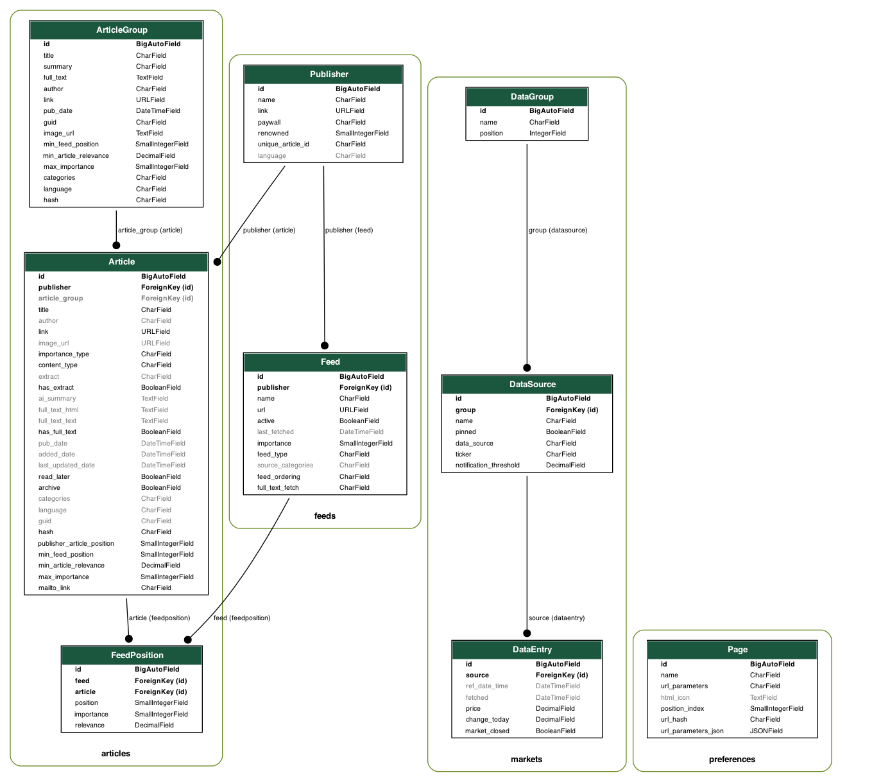

# Data Structure
The Django model data structure is as below:
{ width=100% } 
Django ***manage.py* command** to generate chart:  
`graph_models -g --rankdir BT --disable-sort-fields -o ./docs/docs/imgs/model_schema.png feeds articles markets preferences`
